```
                                _   _        _   _  ___     _         
                               | | | |_ __ _| | | |/ _ \ __| |_  __ _ 
                               | |_| \ V  V / |_| | (_) / _| ' \/ _` |
                                \___/ \_/\_/ \___/ \___/\__|_||_\__,_|                         
```
<!--
**UwUOcha/UwUOcha** is a ✨ _special_ ✨ repository because its `README.md` (this file) appears on your GitHub profile.

Here are some ideas to get you started:

- 🔭 I’m currently working on ...
- 🌱 I’m currently learning ...
- 👯 I’m looking to collaborate on ...
- 🤔 I’m looking for help with ...
- 💬 Ask me about ...
- 📫 How to reach me: ...
- 😄 Pronouns: ...
- ⚡ Fun fact: ...
-->

<p align="center">
  
</p>

<p align="center">
  
</p>
